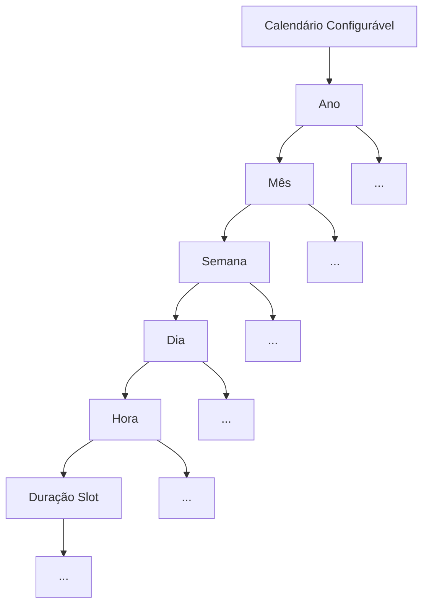
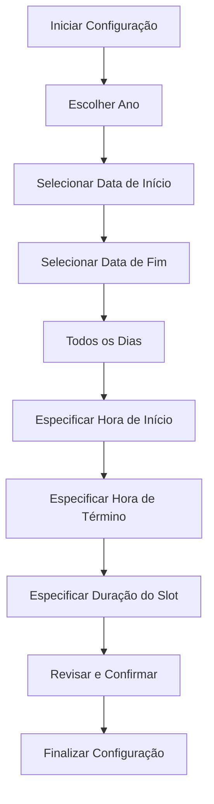
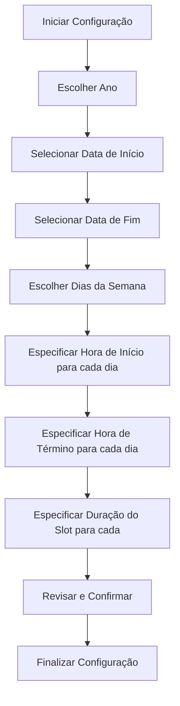
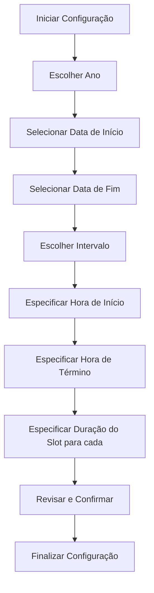

# Lib Calendário Configurável

[English Version](./README.md)

A **Lib Calendário Configurável** é uma biblioteca desenvolvida para facilitar a criação e manipulação de calendários personalizados. Com uma estrutura de árvore bem definida, permite uma navegação intuitiva e flexível, desde o nível de ano até o nível de slots de tempo.

## Estrutura de Árvore

A biblioteca opera em uma estrutura hierárquica de árvore da seguinte forma:

- **Ano**: Cada ano pode ser configurado e apontará para meses.
- **Mês**: Dentro de um ano, cada mês contém semanas.
- **Semana**: Cada semana possui dias.
- **Dia**: Cada dia é subdividido em horas.
- **Hora**: Dentro de um dia, cada hora possui slots de tempo.

Essa estrutura de árvore permite uma organização clara e eficiente de eventos e informações ao longo do tempo.

## Funcionalidades Principais

### Criação de Calendário

Com a **Lib Calendário Configurável**, é possível criar calendários de diversas maneiras:

1. **Para Todos os Dias**: Defina a data de início, data fim, hora de início, hora de fim e a duração de cada slot para todos os dias.
2. **Para Dias Específicos**: Defina data de inicio, data fim, escolha dias da semana (segunda-feira, terça-feira, etc.) e configure a hora de início, hora de fim e duração do slot para cada um desses dias.
3. **Em Intervalos Específicos**: Configure o calendário para dias específicos (por exemplo, a cada 15 dias, 30 dias) a partir de uma data inicial, definindo a hora de início, hora de fim a duração do slot e a data fim.

#### Criar Configuração para todos os dias

O fluxo representa uma sequência estruturada para configurar um calendário personalizado. Começando pela seleção do ano e definindo as datas de início e fim, o processo avança para configurar o calendário para todos os dias. Posteriormente, os horários de início e término são especificados, culminando na definição da duração do slot. O fluxo conclui com uma revisão e confirmação das configurações, garantindo que todas as informações estejam corretas antes de finalizar a configuração do calendário.

#### Para Dias Específicos

O fluxo delineia um processo estruturado adaptado para configurar um calendário com base em dias específicos da semana. Começando pela seleção de um ano e determinando as datas de início e fim, a configuração se concentra em escolher determinados dias da semana. Após isso, são definidos horários de início e término para cada dia selecionado. Posteriormente, a duração do slot para cada dia específico é especificada. O processo culmina com uma etapa de revisão e confirmação, garantindo configurações precisas antes de finalizar a configuração do calendário.

#### Em Intervalos Específicos

O diagrama de fluxo delineia um procedimento estruturado para configurar um calendário com base em intervalos específicos. Iniciado pela seleção de um ano e determinando as datas de início e fim, a configuração então se concentra em escolher um intervalo específico. As etapas subsequentes envolvem especificar os horários de início e término para esse intervalo. Após isso, a duração do slot para cada período é definida. A sequência conclui com uma fase de revisão e confirmação, garantindo configurações precisas antes de finalizar o calendário.

## Como Usar

Para começar a utilizar a biblioteca, consulte a documentação e os exemplos disponíveis. A integração é simples e flexível, permitindo adaptar a biblioteca às necessidades específicas do seu projeto.

---

Esperamos que a **Lib Calendário Configurável** atenda às suas necessidades de gerenciamento de tempo e organização de eventos. Fique à vontade para contribuir, reportar problemas ou enviar sugestões para aprimoramento.

