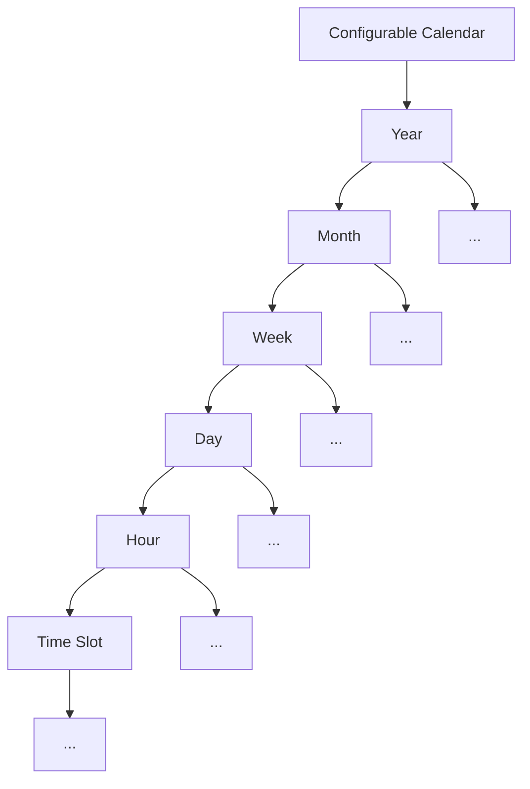
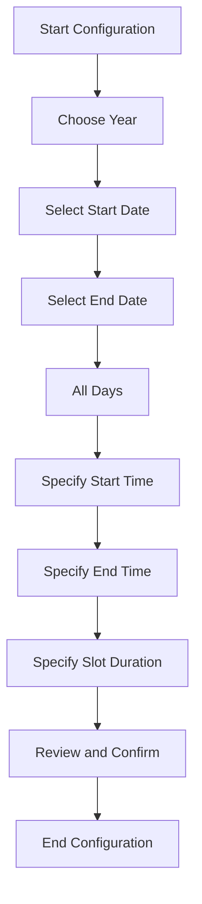
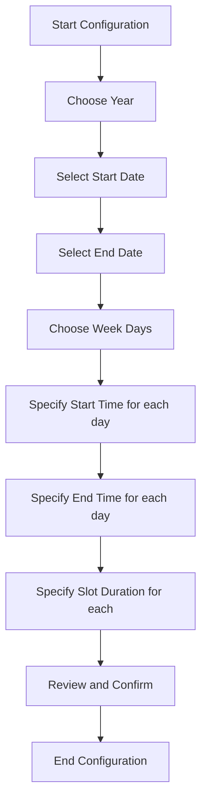
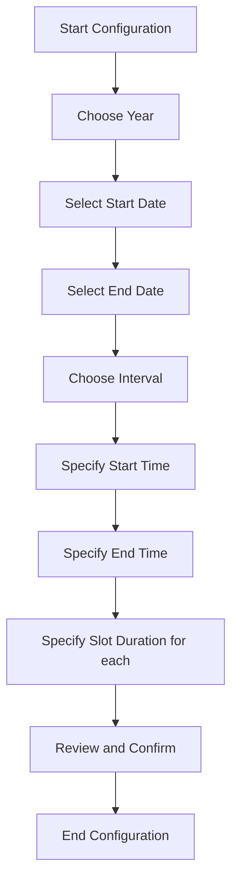

# Configurable Calendar Lib

[Portuguese Version](./LEIAME.md)

The **Configurable Calendar Lib** is a library developed to facilitate the creation and manipulation of personalized calendars. With a well-defined tree structure, it allows for intuitive and flexible navigation from the year level down to the time slots.

## Tree Structure

The library operates on a hierarchical tree structure as follows:

- **Year**: Each year can be configured and will point to months.
- **Month**: Within a year, each month contains weeks.
- **Week**: Each week has days.
- **Day**: Each day is subdivided into hours.
- **Hour**: Within a day, each hour contains time slots.

This tree structure enables clear and efficient organization of events and information over time.

## Key Features

### Calendar Creation

With the **Configurable Calendar Lib**, you can create calendars in various ways:

1. **For All Days**: Set the start date, end date, start time, end time, and slot duration for every day.
2. **For Specific Days**: Set the start date, end date, and choose specific weekdays (Monday, Tuesday, etc.) and set the start time, end time, and slot duration for each of these days.
3. **At Specific Intervals**: Configure the calendar for specific days (e.g., every 15 days, 30 days) from an initial date, defining the start time, end time, slot duration and end date.

#### Create Config for all days

The flow represents a structured sequence for setting up a customized calendar. Starting with the selection of the year and defining start and end dates, the process moves on to configure the calendar for all days. Subsequently, start and end times are specified, culminating in setting the slot duration. The flow concludes with a review and confirmation of the settings, ensuring all information is correct before finalizing the calendar configuration.

#### For Specifics Days

The flow outlines a structured process tailored for setting up a calendar based on specific days of the week. Beginning with the selection of a year and determining start and end dates, the configuration narrows down to choosing particular weekdays. Following this, individual start and end times are set for each selected day. Subsequently, the slot duration for each specific day is specified. The process culminates with a review and confirmation step, ensuring accurate settings before finalizing the calendar configuration.

#### At Specific Intervals

The flow diagram delineates a structured procedure for setting up a calendar based on specific intervals. Initiated by selecting a year and determining the start and end dates, the configuration then focuses on choosing a particular interval. Subsequent steps involve specifying the start and end times for this interval. Following this, the slot duration for each period is defined. The sequence concludes with a review and confirmation phase, ensuring precise configurations before finalizing the calendar 

## Getting Started

To begin using the library, refer to the documentation and available examples. Integration is straightforward and flexible, allowing you to tailor the library to the specific needs of your project.

---

We hope the **Configurable Calendar Lib** meets your time management and event organization needs. Feel free to contribute, report issues, or send suggestions for improvement.
